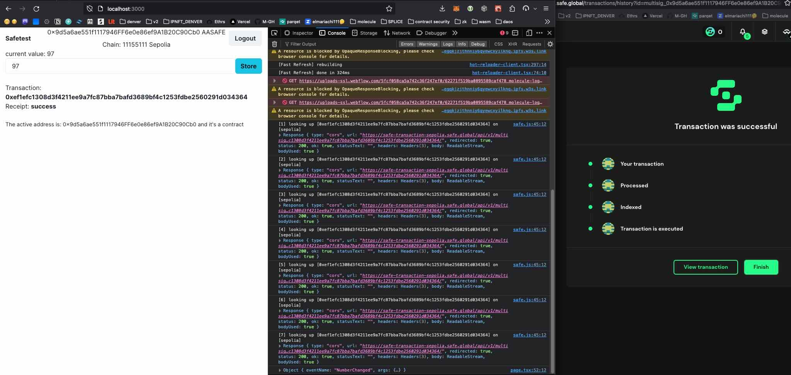

# Wait for Transaction Receipts for AA (Safe) wallets

This library is compatible to wagmi hooks & viem publicProviders. It allows waiting for transaction receipts for Safe transactions. This is helpful when your users are connecting their Safe accounts using Walletconnect. Under certain circumstances a transaction submitted on that connection returns the `safeTx` hash of the Safe's infrastructure; this mostly happens when users choose to use Safe's own transaction relay to subsidize their execution. To wait for a regular transaction receipt, you first must resolve the onchain transaction that has been executed by the respective relayer or submitted by the final signer.

This library first queries the provided transaction hash from Safe's transaction service. If cannot find one, it assumes that it's a "real" transaction. Otherwise it consecutively requests the successful "real" message from the service 10 times, using a polynomial backoff strategy. Once found, it uses the known procedure to wait for that transaction's receipt.

Should be useable as a dropin replacement for [Wagmi's waitForTransactionReceipt](https://wagmi.sh/core/api/actions/waitForTransactionReceipt#waitfortransactionreceipt).

## available hooks

- `useIsSafeWallet(address: Address): boolean|undefined` figures out whether address is a Safe account
- `useSafeWaitForTransaction(writeResult: WriteContractResult | undefined)` a drop in replacement for `useWaitForTransaction`
- `safeWaitForTransactionReceipt(publicClient, {hash, address})` plain viem usage: takes a public client & an address and returns `Promise<TransactionReceipt>``

## plain provider usage

```ts
import { useAccount, configureChains } from "wagmi";
import { safeWaitForTransactionReceipt } from "@moleculexyz/wagmi-safe-wait-for-tx";

//some configuration
const { publicClient: configureClient } = configureChains(SUPPORTED_CHAINS, [
  publicProvider(),
]);

export const publicClient = publicClient({ chainId: 1 });

//... in your code
const publicClient = usePublicClient();
const { data: walletClient } = useWalletClient();
const hash = await walletClient.writeContract(request);
// if the account is a Safe, this will resolve hash as `safeTx` under the hood:
const receipt = await safeWaitForTransactionReceipt(publicClient, {
  hash,
  address: walletClient.account,
});
```

## wagmi usage

```ts
  import { useSafeWaitForTransaction } from "@moleculexyz/wagmi-safe-wait-for-tx";

  export default function Component() {
    const { address } = useAccount();
    const { writeAsync } = useSomeContract();
    const [tx, setTx] = useState<WriteContractResult>();

    // in case of a connected Safe, `tx.hash` is a `safeTx` hash.
    // this detects Safe accounts and first tries to resolve tx.hash
    const { data: receipt, isError, isLoading } = useSafeWaitForTransaction(tx);

    useEffect(() => {
      if (!receipt) return;
      //decode logs as you like...
      const decodedEvent = safeDecodeLogs(receipt, storageABI).find(
        (e) => e?.eventName == "Transfer"
      );
      console.log(numberChangedEvent);
    }, [receipt]);

    const onSubmit = useCallback(async () => {
      setTx(
        await writeAsync({
          args: [...],
        })
      );
    }, [writeAsync]);
  }

```

# Notes

This kind of issue will become very apparent with AA/4337, where a transaction is not originating from a private key (or MPC wallet). Safe is actually still the simplest implementation here; when users start adopting more advanced bundler based transaction execution layers, figuring out the "real" transaction hashes for the frontend to follow on likely will become a nightmare. It's actually the connected provider's job to resolve the real onchain details after a transaction has been relayed; but that's not implemented at the moment for Walletconnect.

This implementation ideally has to go into a more sophisticated `WalletProvider` that's figuring out the kind of connected account. A public provider doesnt know anything about the connected account, so it'd be the connector's job (likely WalletConnect) to translate a `safeTx` for the actual transaction hash or offer helper functions for clients to use.

## The demo app

This monorepo's demo app makes things slightly more complex since it uses  [Privy](https://privy.io) to support social login based MPC wallets. The [Privy <> Wagmi layer](https://docs.privy.io/guide/guides/wagmi) is rather stable after wagmi 2 has been integrated. The app runs on Next 14 with apps router enabled.



## Original Issues

https://ethereum.stackexchange.com/questions/155384/how-to-get-receipt-in-wagmi-viem-for-a-transaction-issued-with-safe-on-walletc

Copyright (c) 2024 by [Molecule AG](https://molecule.xyz)
